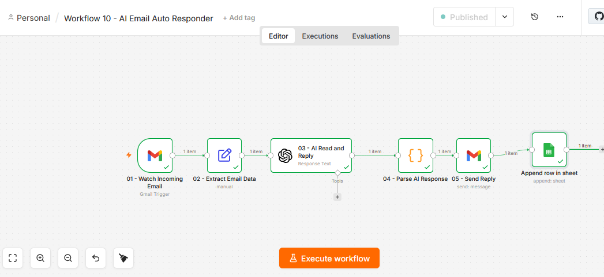

# AI Email Auto Responder — n8n Workflow

Most businesses lose leads because they reply to emails too slowly.
Someone sends a pricing question at night and gets a reply the next morning.
By then they already hired someone else.

This workflow fixes that. Every email gets a smart professional reply within 60 seconds — automatically — day or night — without any human involvement.

---

## Live Demo



---

## Who This Is For

- Digital marketing agencies drowning in daily inquiries
- Real estate agents who miss leads during showings
- Coaches and consultants getting the same questions repeatedly
- E-commerce stores handling customer questions at scale
- Any business where slow email response costs them clients

---

## What It Does

- Catches every incoming email automatically
- AI reads the email and understands what the person wants
- Writes a warm professional reply that sounds human
- Sends the reply back within 60 seconds
- Logs every email and reply to Google Sheets
- Categorizes each email so you see what people ask most

---

## Stack

| Tool | Role |
|------|------|
| n8n | Automation engine |
| OpenAI GPT-4o-mini | Email reading and reply writing |
| Gmail | Incoming email trigger and outgoing reply |
| Google Sheets | Full email and reply logging |

---

## Workflow Architecture

```
New email arrives in Gmail
          ↓
01 - Watch Incoming Email
     Polls inbox every 60 seconds
          ↓
02 - Extract Email Data
     Cleans sender name, email, subject, body
          ↓
03 - AI Read and Reply
     GPT-4o-mini reads intent
     Writes professional reply
          ↓
04 - Parse AI Response
     Extracts reply text and category
          ↓
05 - Send Reply
     Fires reply back to sender via Gmail
          ↓
06 - Log to Sheet
     Saves full record to Google Sheets
```

---

## Node Configuration

### 01 — Watch Incoming Email

Watches the Gmail inbox every 60 seconds.
Fires the entire workflow the moment a new email arrives.

```
Type      : Gmail Trigger
Event     : Message Received
Poll Time : Every 1 Minute
Simplify  : ON
```

---

### 02 — Extract Email Data

Gmail returns data in a deeply nested structure.
This node pulls exactly what is needed into clean usable fields.

```
Type : Edit Fields (Set)
Mode : Manual Mapping

sender_email → {{ $json.from.value[0].address }}
sender_name  → {{ $json.from.value[0].name }}
subject      → {{ $json.subject }}
body         → {{ $json.snippet }}
```

> Use `$json.snippet` for body. The `$json.text` field returns empty
> in some configurations. Snippet is always populated.

---

### 03 — AI Read and Reply

The core of the workflow.
GPT-4o-mini reads the email, identifies the intent,
and writes a reply that matches the business voice.

```
Type      : OpenAI
Model     : GPT-4o-mini
Operation : Message a Model
```

**System Prompt:**
```
You are a professional email assistant for a Digital Marketing Agency.

Your job is to read incoming emails and write a professional,
warm, and helpful reply.

RULES:
- Always greet the sender by their first name
- Keep the reply short and clear
- Sound human — not robotic
- Always end with a call to action
- Sign off as: "Best regards, Sarah — Digital Marketing Team"

TYPES OF EMAILS YOU WILL HANDLE:

1. PRICING QUESTION
If they ask about price or cost, reply with:
Our packages start from $500/month.
We offer Social Media, Google Ads, and SEO packages.
Book a free call to get a custom quote.

2. SERVICE INQUIRY
If they ask what services we offer, reply with:
We offer Social Media Marketing, Google Ads,
Facebook Ads, SEO, and Email Automation.
Each package is customized to your business needs.

3. MEETING REQUEST
If they want to book a call or meeting, reply with:
We would love to connect!
Book a free 30-minute call here: [calendar-link]
We are available Monday to Friday, 9am to 6pm.

4. GENERAL EMAIL
Write a warm professional reply that fits the context.

RESPONSE FORMAT:
Return ONLY a valid JSON object. Nothing else.

{
  "reply": "<full email reply>",
  "category": "<Pricing/Service/Meeting/General>"
}
```

**User Message:**
```
Sender Name : {{ $json.sender_name }}
Sender Email: {{ $json.sender_email }}
Subject     : {{ $json.subject }}
Email Body  : {{ $json.body }}

Write a professional reply to this email.
```

---

### 04 — Parse AI Response

AI returns a plain text string.
This node converts it into a real object and packages
everything together for the next nodes.

```
Type    : Code Node
Language: JavaScript
Mode    : Run Once for All Items
```

```javascript
const items = $input.all();
const results = [];

for (const item of items) {

  const rawText = item.json.output[0].content[0].text;
  const parsed = JSON.parse(rawText);

  results.push({
    json: {
      sender_email: $('02 - Extract Email Data').item.json.sender_email,
      sender_name : $('02 - Extract Email Data').item.json.sender_name,
      subject     : $('02 - Extract Email Data').item.json.subject,
      body        : $('02 - Extract Email Data').item.json.body,
      reply       : parsed.reply,
      category    : parsed.category
    }
  });
}

return results;
```

---

### 05 — Send Reply

Sends the AI written reply back to the sender.
The Re: prefix makes it look like a genuine human response.

```
Type    : Gmail — Send Email
To      : {{ $json.sender_email }}
Subject : Re: {{ $json.subject }}
Message : {{ $json.reply }}
```

---

### 06 — Log to Sheet

Every email and reply gets saved with full detail.
The client has complete visibility into every conversation.

```
Type : Google Sheets — Append Row

Timestamp    → {{ $now.toISO() }}
Sender Name  → {{ $('04 - Parse AI Response').item.json.sender_name }}
Sender Email → {{ $('04 - Parse AI Response').item.json.sender_email }}
Subject      → {{ $('04 - Parse AI Response').item.json.subject }}
Email Body   → {{ $('04 - Parse AI Response').item.json.body }}
AI Reply     → {{ $('04 - Parse AI Response').item.json.reply }}
Status       → Replied
```

---

## Google Sheets Setup

```
Create a new spreadsheet
Name: Workflow 10 - Email Auto Responder

Add these headers in Row 1:
A1 : Timestamp
B1 : Sender Name
C1 : Sender Email
D1 : Subject
E1 : Email Body
F1 : AI Reply
G1 : Status
```

---

## Email Categories

| Category | Trigger | Response |
|----------|---------|----------|
| Pricing | Asks about cost or packages | Starting price + book a call |
| Service | Asks what services are offered | Full service list |
| Meeting | Wants to schedule a call | Calendar link + hours |
| General | Anything else | Custom warm professional reply |

---

## Important Notes

**OpenAI response path**
```
Correct → output[0].content[0].text
Wrong   → message.content
```

**Referencing data after processing nodes**
```
Correct → $('04 - Parse AI Response').item.json.sender_email
Wrong   → $json.sender_email
```

**Email body field**
Always use `$json.snippet` — more reliable than `$json.text`

**Subject line**
Prefix with `Re:` so the reply looks like a real human response

---

## Pricing Guide

| Package | Includes | Price |
|---------|----------|-------|
| Starter | 4 categories + sheet logging | $300 |
| Professional | Custom brand voice + 6 categories + priority support | $500 |
| Agency | Full setup + custom prompts + monthly maintenance | $600 + $100/mo |

---

## License

MIT — free to use and modify for client projects.

---

*Built with n8n · OpenAI · Gmail · Google Sheets*
